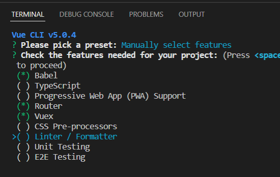
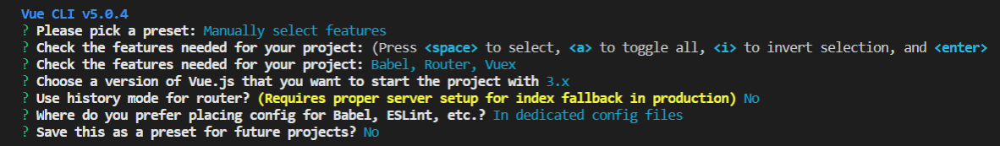
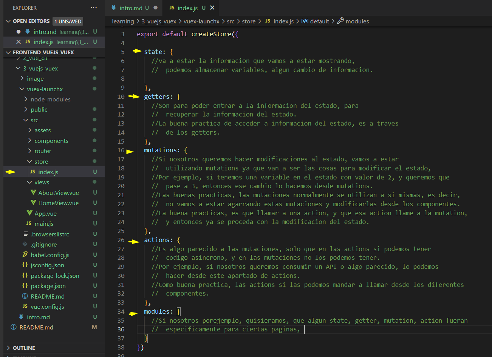

# Vuex

Es un manejadores de estado y este es algo que todo lo que se va a ir almacenando y no hay que guardar datos confidenciales.

Creamos un proyecto con las siguientes caracteristicas

Explicacion de Vuex, estados.

